<!-- Please do not change this logo with link -->
<a target="_blank" href="https://www.microchip.com/" id="top-of-page">
   <picture>
      <source media="(prefers-color-scheme: light)" srcset="images/logos/mchp_logo_light.png" width="350">
      <source media="(prefers-color-scheme: dark)" srcset="images/logos/mchp_logo_dark.png" width="350">
      
   </picture>
</a>

# SPI Driver using the PIC18F56Q71 Microcontroller and MCC Melody
This code example demonstrates how to communicate as host and client using the SPI protocol in interrupt and polling modes on a PIC18F56Q71 microcontroller with MPLAB MCC Melody. The [SPI Host demo](#spi-host) writes data to a 7 Segment Display upon the press of a hardware button. The [SPI Client demo](#spi-client) exchanges data between two PIC18F56Q71 microcontrollers and displays the exchanged data on a serial terminal.

## Related Documentation
- [SPI Release Notes](https://onlinedocs.microchip.com/v2/keyword-lookup?keyword=MCC.MELODY.SCF-AVR8-SPI-V1.RELEASENOTES&version=latest&redirect=true)
- [PIC18F-Q71 Family Product Page](https://www.microchip.com/en-us/products/microcontrollers-and-microprocessors/8-bit-mcus/pic-mcus/pic18-q71)

## Software Used
- [MPLAB® X IDE v6.15 or newer](http://www.microchip.com/mplab/mplab-x-ide)
- [MPLAB® XC8 Compiler v2.45 or newer](https://www.microchip.com/en-us/tools-resources/develop/mplab-xc-compilers/xc8)
- [MPLAB® Code Configurator (MCC) v5.4.1 or newer](https://www.microchip.com/en-us/tools-resources/configure/mplab-code-configurator)

## Hardware Used
- [PIC18F56Q71 Curiosity Nano](https://www.microchip.com/en-us/development-tool/EV01G21A)
- [Curiosity Nano Base for Click boards™](https://www.microchip.com/Developmenttools/ProductDetails/AC164162)
- [7Seg Click board™](https://www.mikroe.com/7seg-click)

## [SPI Host Demonstration](#spi-host)
### [Setup for Host Demo](#setup-for-host-demo)
1. Download the ZIP file containing the source code and extract it.
2. Connect the 7seg click board to Curiosity Nano Base on mikro Bus port 1.
3. Connect the Curiosity Nano Board to the Curiosity Nano Base.
4. Connect the Curiosity Nano board to the system.
5. Open MPLAB® X IDE.
6. Click on File -> Open Project.
7. Navigate to to the extracted source code folder and select both projects with spi-host in the project names.
8. Click on **Open Project** button in the window.
    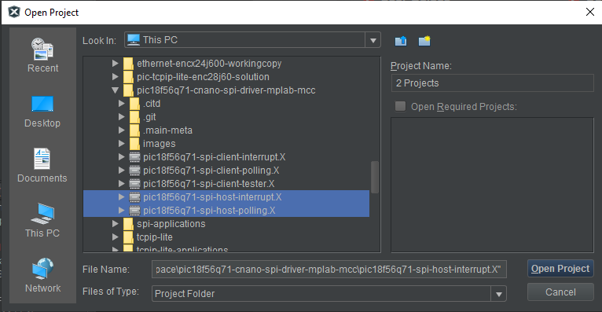
9.  The following configuration was made in MCC Melody UI for SPI Host Driver with Interrupt Driven toggled on for interrupt project.
    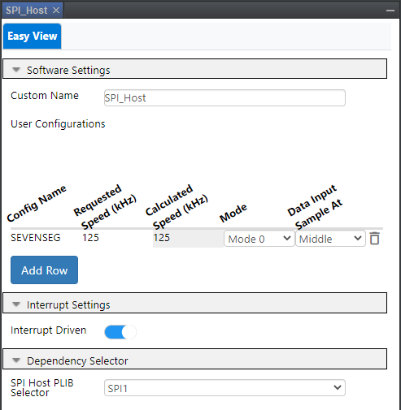
10. The following pin configurations were made in MCC Melody UI for both SPI Host Driver projects.
    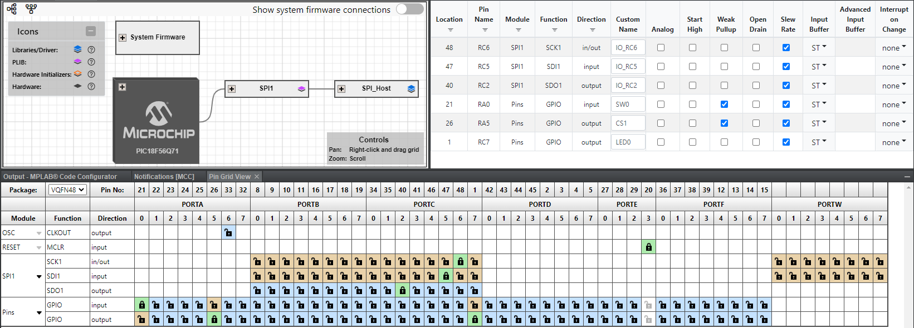

### Operation: Host Polling
1. From the Projects window on MPLAB, right click on `pic18f56q71-spi-host-polling` project and select **Make and Program Device** to program the code to the device.
    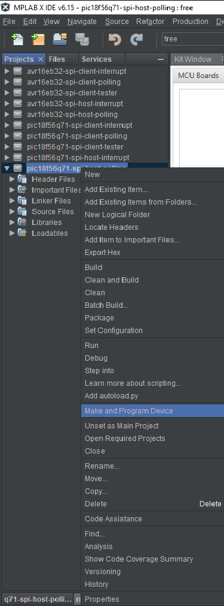
2. A dialog box will pop up asking to select the tool to be programmed. Select the connected tool from the drop down box. Click **OK**.
    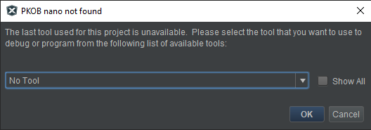
3. The seven segment display will now show `--` once the programming is complete.
4. Press SW0 on the Curiosity Nano. The display will now show `00`.
5. Press SW0 again to increment the number displayed on the 7-segment.

### Operation: Host Interrupt
1. From the Projects window on MPLAB, right click on `pic18f56q71-spi-host-interrupt` project and select **Make and Program Device** to program the code to the device.
    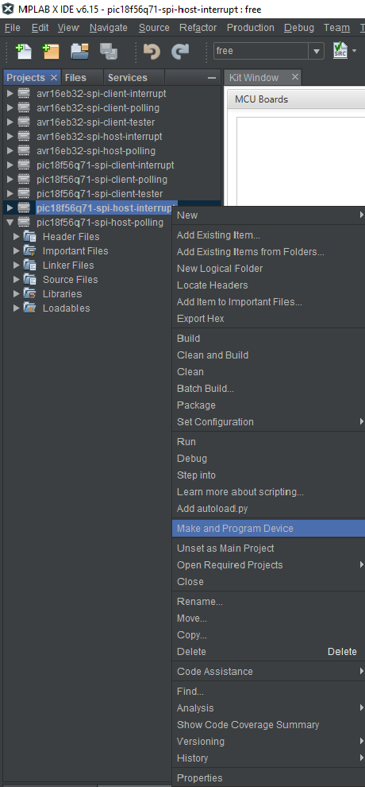
2. A dialog box will pop up asking to select the tool to be programmed. Select the connected tool from the drop down box. Click **OK**.
    
3. The seven segment display will now show `--` once the programming is complete.
4. Press SW0 on the Curiosity Nano. The display will now show `00`.
5. Press SW0 again to increment the number displayed on the 7-segment.

## [SPI Client Demonstration](#spi-client)
### [Setup for Client Demo](#setup-for-client-demo)
1. Download the ZIP file containing the source code and extract it.
2. Connect the Serial Data Out (SDO), Serial Data In (SDI) Serial Clock (SCK), Chip Select 1 (CS1) and Ground (GND) pins of two Curiosity Nano Boards to each other.
   For this demonstration with PIC18F56Q71 th pin-outs are as follows:
   | Pin Function | Hardware Pin |
   | ------------ | ------------ |
   | SDO          | RC2          |
   | SDI          | RC5          |
   | SCK          | RC6          |
   | CS1          | RA5          |
   | GND          | GND          |
3. Open MPLAB® X IDE.
6. Click on File -> Open Project.
7. Navigate to to the extracted source code folder and select all three projects with spi-client in the project names.
8. Click on **Open Project** button in the window.
    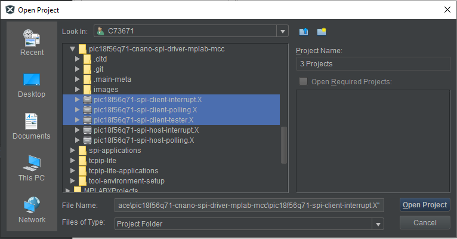
9. Connect one development board to the system. Make note of the serial number on the back of the development board.
10. From the Projects window on MPLAB, right click on `pic18f56q71-spi-client-tester` project and select **Make and Program Device** to program the code to the device.
    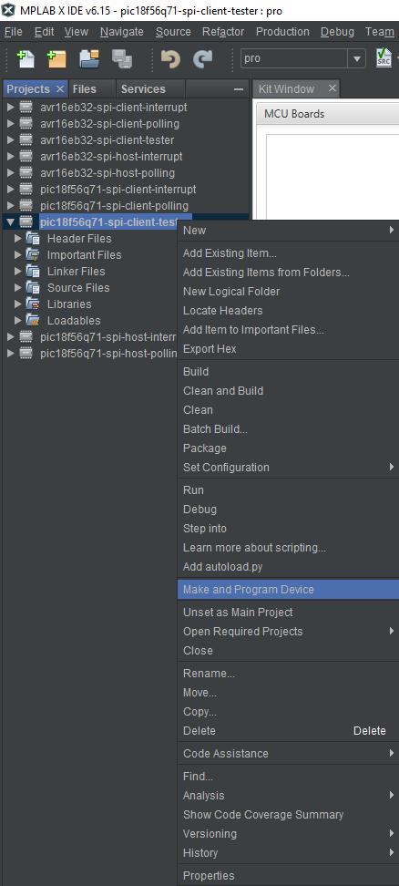
11. A dialog box will pop up asking to select the tool to be programmed. Select the connected tool from the drop down box. Click **OK**.
    
12. After the device gets programmed, the onboard LED0 will flash once every second indicating that it is working as expected. The setup for testing client projects is now complete. Disconnect the tester for now. The `spi-client-polling` and `spi-client-interrupt` projects are pre-configured as mentioned in the next 2 points.
13. The following configuration was made in MCC Melody UI for SPI Client Driver with Interrupt Driven toggled on for interrupt project.
    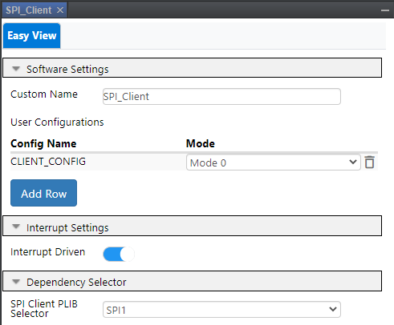
14. The following pin configurations were made in MCC Melody UI for both SPI Client Driver projects.
    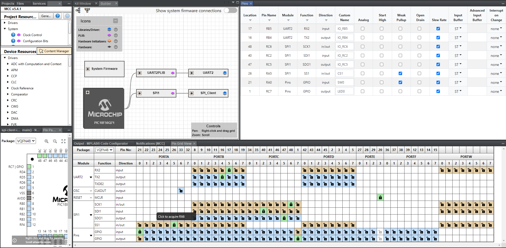

### Operation: Client Polling
1. Open MPLAB® Data Visualizer from the tool bar above. Alternatively go to Window -> Debugging -> Data Visualizer.
3. With the Data Visualizer open, connect the other development board to the system. Make note of the COM port assigned to the connected device.
2. Hover the cursor over the COM port of the device just connected and select the option **Display as Text in the Terminal**.
    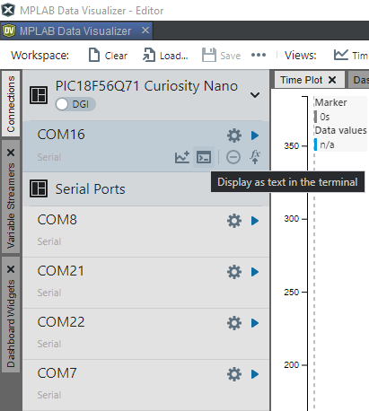
4. Now connect the tester development board which was used in [Setup for Client Demo](#setup-for-client-demo) to the system. The client tester will start working automatically.
5. From the Projects window on MPLAB, right click on `pic18f56q71-spi-client-polling` project and select **Make and Program Device** to program the code to the device.
    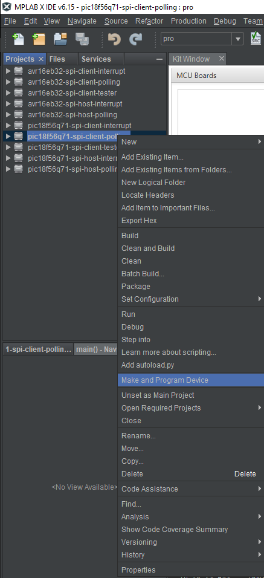
6. A dialog box will pop up asking to select the tool to be programmed. From the drop down box select a different tool from the one selected before in [Setup for Client Demo](#setup-for-client-demo). The serial number can be found on the back of the development board. Click **OK**.
    
7. Once the programming is complete, the terminal window in Data Visualizer will display the results. If the data exchange happens as expected, `SUCCESS` will be displayed in the terminal. See example below:
    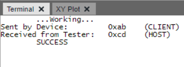

### Operation: Client Interrupt
1. Open MPLAB® Data Visualizer from the tool bar above. Alternatively go to Window -> Debugging -> Data Visualizer.
3. With the Data Visualizer open, connect the other development board to the system. Make note of the COM port assigned to the connected device.
2. Hover the cursor over the COM port of the device just connected and select the option **Display as Text in the Terminal**.
    
4. Now connect the tester development board which was used in [Setup for Client Demo](#setup-for-client-demo) to the system. The client tester will start working automatically.
5. From the Projects window on MPLAB, right click on `pic18f56q71-spi-client-interrupt` project and select **Make and Program Device** to program the code to the device.
    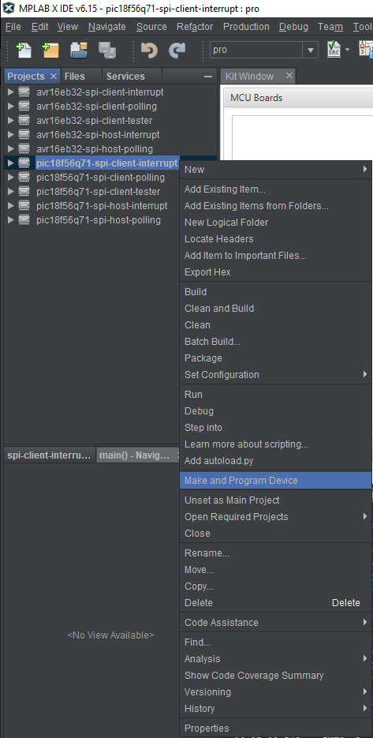
6. A dialog box will pop up asking to select the tool to be programmed. From the drop down box select a different tool from the one selected before in [Setup for Client Demo](#setup-for-client-demo). The serial number can be found on the back of the development board. Click **OK**.
    
7. Once the programming is complete, the terminal window in Data Visualizer will display the results. If the data exchange happens as expected, `SUCCESS` will be displayed in the terminal. See example below:
    

## Summary
The demo provides examples of communication as both Host and Client using the SPI protocol in interrupt and polling modes of operation. The demo utilizes firmware code generated using MPLAB® Code Configurator (MCC) Melody.